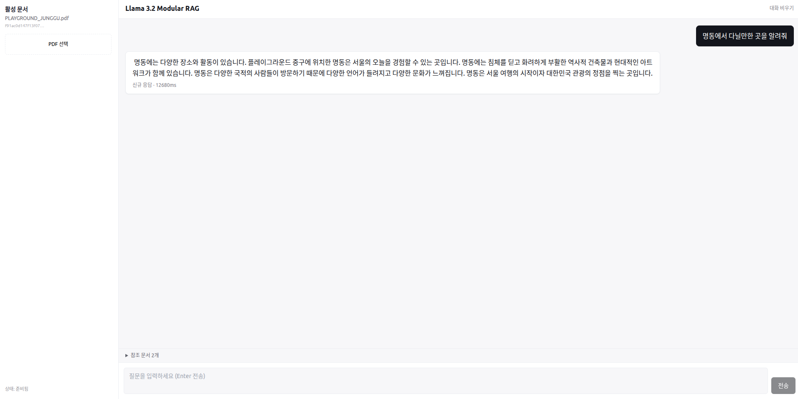

# Llama 3.2 Modular RAG

CPU 환경에서 동작하는 한국어 RAG 시스템. LangChain + LangGraph 기반의 백엔드와 React + Vite + Tailwind 프론트엔드로 구성된 dev 모노리포.



PDF를 업로드하고 한국어로 질문하면 토큰이 SSE로 스트리밍되며, 응답 하단에 참조 문서 청크가 토글로 노출됩니다.

## 구성

```
.
├── backend/                       # Python (3.10) RAG + FastAPI
│   ├── app/                       # FastAPI 라우터·lifespan
│   │   ├── main.py
│   │   ├── deps.py                # AppState (vectorstore/graph/cache/lock)
│   │   ├── streaming.py           # TextIteratorStreamer 기반 토큰 스트리밍
│   │   └── api/
│   │       ├── routes.py          # /api/health, /api/query, /api/query/stream, /api/upload
│   │       └── schemas.py         # Pydantic v2
│   ├── llama_modular_rag/         # 핵심 RAG 패키지
│   │   ├── config.py              # init_runtime() + 경로/하이퍼파라미터
│   │   ├── data_loader.py         # PDF → Chroma (doc_id 반환)
│   │   ├── embeddings.py          # ko-sroberta (lru_cache)
│   │   ├── llm_setup.py           # Llama 3.2 1B (lru_cache)
│   │   ├── retrieval.py           # 검색 + 토크나이저 기반 컨텍스트 빌더
│   │   ├── generation.py          # 프롬프트·LLM·StrOutputParser 체인
│   │   ├── state.py               # RAGState (TypedDict)
│   │   ├── graph_builder.py       # LangGraph 컴파일
│   │   ├── caching.py             # JSON 캐시 (sha256(doc_id::query))
│   │   └── main.py                # CLI 진입점
│   ├── models/                    # 로컬 가중치 (HF snapshot 스크립트로 다운로드)
│   ├── cache/                     # 쿼리 응답 캐시 (.json)
│   ├── vector_db/                 # Chroma 영속 디렉토리
│   ├── requirements.txt
│   ├── .env.example
│   └── setup.py
│
├── frontend/                      # Node 18, React 18.3 + Vite 5.4 + TS 5.6 + Tailwind 3.4
│   ├── package.json
│   ├── vite.config.ts             # /api → http://localhost:8000 프록시
│   ├── tailwind.config.js
│   └── src/
│       ├── main.tsx
│       ├── App.tsx
│       ├── components/            # ChatPanel, MessageList, MessageBubble, InputBox, DocumentPanel
│       ├── hooks/useRagQuery.ts   # SSE 구독 + AbortController
│       ├── lib/api.ts             # fetch 래퍼 (REST + SSE)
│       └── lib/sse.ts             # text/event-stream 파서
│
└── docs/                          # 아키텍처·UML 문서
    ├── architecture.md
    └── uml.md
```

## 사전 준비

- **Python 3.10** + 다음 모델 가중치를 `backend/models/`에 미리 받아둡니다.
  - `torchtorchkimtorch-Llama-3.2-Korean-GGACHI-1B-Instruct-v1`
  - `ko-sroberta-multitask`
  - 처음 받는 경우 backend의 snapshot 스크립트를 사용:
    ```bash
    cd backend
    python snapshot_llama-3.2-korean-ggachi-1b-instruct-v1.py
    python snapshot_ko_sroberta_multitask.py
    ```
- **Node 18.18+** (Vite 5 / Tailwind 3 호환)

## 백엔드 (dev)

```bash
cd backend

# 가상환경 / conda env 활성화 후
pip install -r requirements.txt

# 환경변수 (선택)
cp .env.example .env
# .env에서 RAG_DEFAULT_PDF, LOG_LEVEL, RAG_NUM_THREADS, MAX_UPLOAD_MB 조정 가능

# FastAPI 개발 서버
uvicorn app.main:app --reload --reload-dir app --port 8000
# API 문서: http://localhost:8000/docs
```

`--reload-dir app`은 FastAPI 라우터 변경만 감지합니다. RAG 코드(`llama_modular_rag/`)를 수정한 경우 무거운 모델 재로딩을 피하기 위해 수동 재시작을 권장합니다.

### 엔드포인트

| 메서드 | 경로 | 설명 |
| --- | --- | --- |
| `GET` | `/api/health` | 모델/문서 준비 상태 |
| `POST` | `/api/query` | `{query}` → `{answer, documents, cached, elapsed_ms}` |
| `POST` | `/api/query/stream` | SSE로 토큰 스트리밍. `docs` → `token*` → `done` 이벤트 순. `error` 이벤트는 처리 중 예외 |
| `POST` | `/api/upload` | PDF 업로드 (multipart, 기본 50MB 한도). 업로드 시 활성 문서가 즉시 갱신됨 |

### CLI (백엔드 단독 실행)

FastAPI 없이 RAG 파이프라인을 직접 돌려보고 싶을 때:

```bash
cd backend
python -m llama_modular_rag.main
```

기본 PDF는 `backend/llama_modular_rag/PLAYGROUND_JUNGGU.pdf`입니다.

## 프론트엔드 (dev)

```bash
cd frontend
npm install
npm run dev          # http://localhost:5173
```

`vite.config.ts`의 `server.proxy`가 `/api`를 백엔드 8000으로 포워딩하므로 CORS 설정이 필요 없습니다. 백엔드를 다른 포트나 호스트에서 띄우려면:

```bash
VITE_BACKEND_URL=http://10.0.0.5:8000 npm run dev
```

### 사용 흐름

1. 사이드바 **PDF 선택**으로 문서 업로드 → `/api/upload`
2. health 폴링이 `ready: true`로 바뀌면 입력창이 활성화됨
3. 질문 입력 (Enter 전송 / Shift+Enter 줄바꿈) → `/api/query/stream` (SSE)
4. `docs` 이벤트로 참조 문서가 먼저, 이어서 `token` 이벤트가 토큰 단위로 도착해 말풍선에 누적
5. 응답 하단의 **참조 문서**에서 검색된 청크 확인
6. 진행 중 응답은 **취소** 버튼으로 `AbortController.abort()` — 서버는 `request.is_disconnected()`로 SSE 송신을 중단

## 핵심 설계 선택

- **단일 워커 + 단일 모델 인스턴스**: `uvicorn --workers 1` 권장. 추론은 `run_in_threadpool` + `asyncio.Lock`으로 직렬화 (1B 모델 동시 호출 회피).
- **부수효과 격리**: `config.init_runtime()`이 호출돼야 CUDA 비활성화·CPU 스레드 수가 적용됨. `app/main.py`와 CLI `main.py`가 진입점에서 호출.
- **캐시 키**: `sha256(doc_id || "::" || query)` JSON 파일. 같은 질문/다른 문서면 자동 분리. 스키마 버전(`_v`) 변경 시 자동 무효화.
- **컬렉션 이름 정규화**: Chroma 제약을 만족하도록 `doc_<sha32>` 형식으로 강제 — 한국어 PDF 파일명도 안전.
- **샘플링**: `do_sample=True`, `temperature=0.1`, `top_p=0.95` (transformers 4.50+ greedy 폴백 회피).
- **SSE 스트리밍**: `TextIteratorStreamer` + 백그라운드 `Thread`로 `model.generate`를 실행해 이벤트 루프 차단을 피함. 비스트리밍/스트리밍 경로 모두 동일한 `ANSWER_PROMPT_TEXT`를 공유.

## 사용 모델

- **Llama 3.2 Korean GGACHI 1B Instruct** — 답변 생성
- **Ko-sRoBERTa-multitask** — 임베딩

`backend/llama_modular_rag/config.py`의 `LLAMA_MODEL_PATH`, `EMBEDDING_MODEL_NAME`을 수정해 다른 모델로 교체할 수 있습니다.

## 문서

- [docs/architecture.md](docs/architecture.md) — 시스템 컨텍스트, 레이어 책임, 런타임 흐름, 핵심 설계 결정
- [docs/uml.md](docs/uml.md) — Mermaid 기반 컴포넌트·클래스·시퀀스·상태 다이어그램

## 라이선스

MIT
