# UML 다이어그램

`Llama 3.2 Modular RAG`의 정적 구조와 동적 흐름을 Mermaid 다이어그램으로 정리했습니다.
GitHub/GitLab/Mermaid Live Editor 등에서 그대로 렌더링됩니다.

> **표기 규칙**
> - 클래스 다이어그램은 백엔드 RAG 코어와 FastAPI 어댑터 레이어를 중심으로 작성합니다.
> - 시퀀스 다이어그램은 “업로드 → 비스트리밍 쿼리 → 스트리밍 쿼리” 세 시나리오를 다룹니다.
> - 컴포넌트 다이어그램은 프론트/백엔드/외부 자원의 배치를 보여줍니다.

---

## 1. 컴포넌트 다이어그램 (System Context)

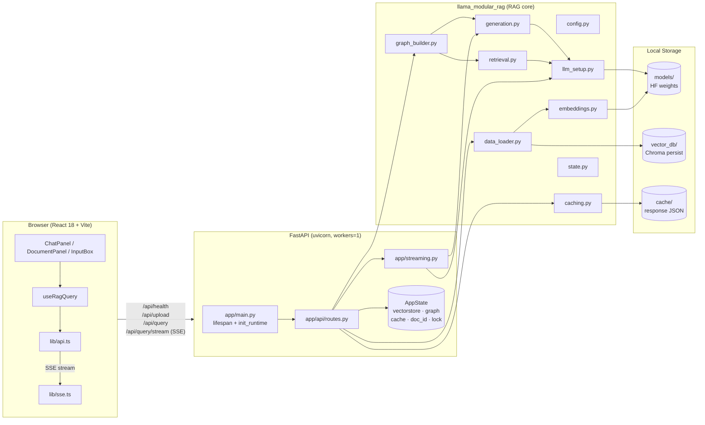

---

## 2. 클래스 다이어그램 (백엔드)

### 2.1 RAG 코어 + 어댑터 레이어

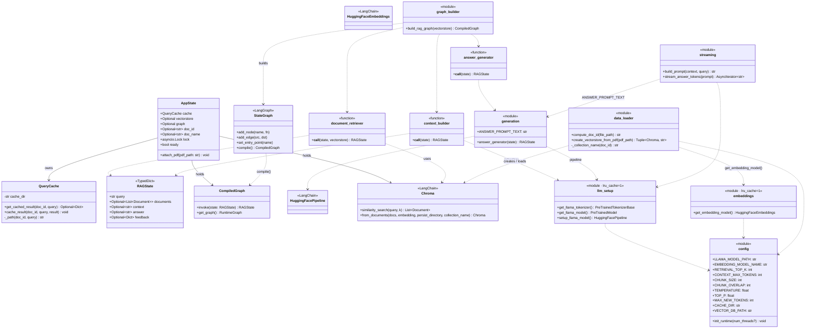

### 2.2 FastAPI 라우터 / 스키마

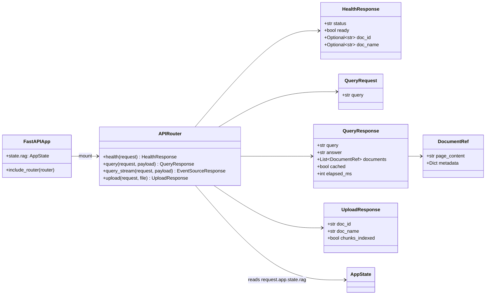

---

## 3. 클래스 다이어그램 (프론트엔드)

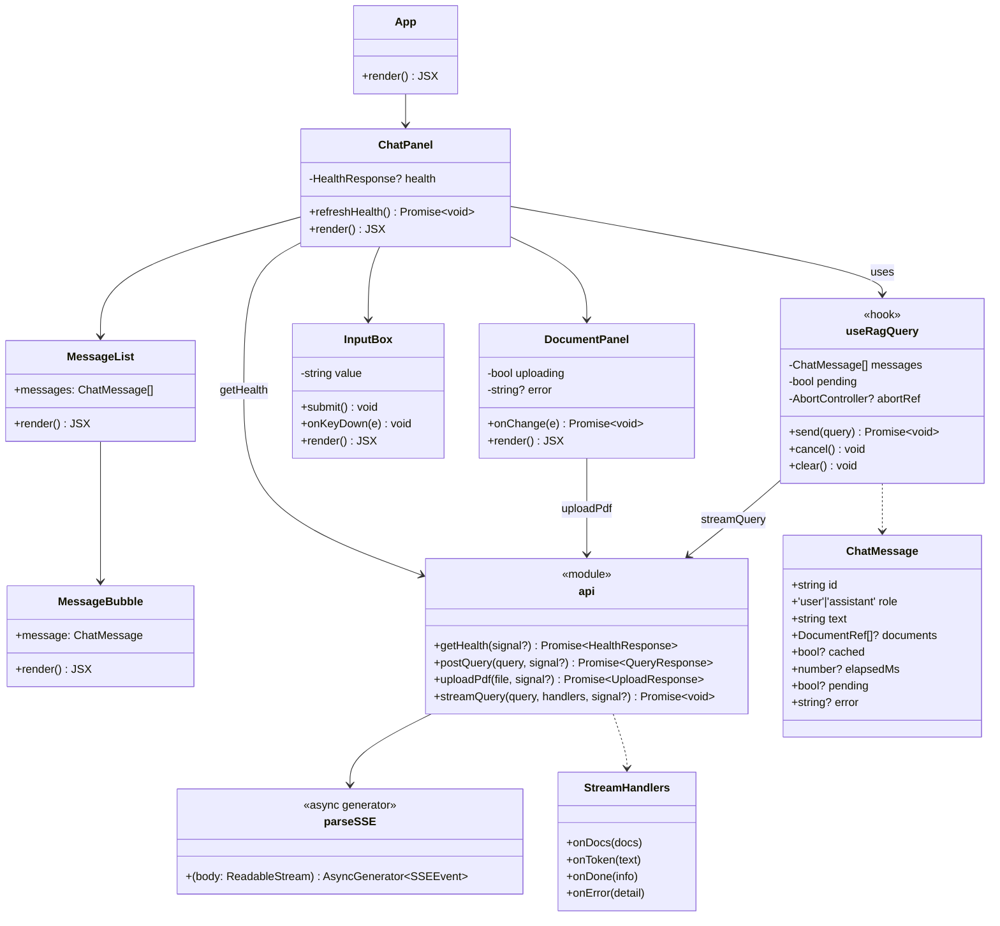

---

## 4. 시퀀스 다이어그램

### 4.1 PDF 업로드

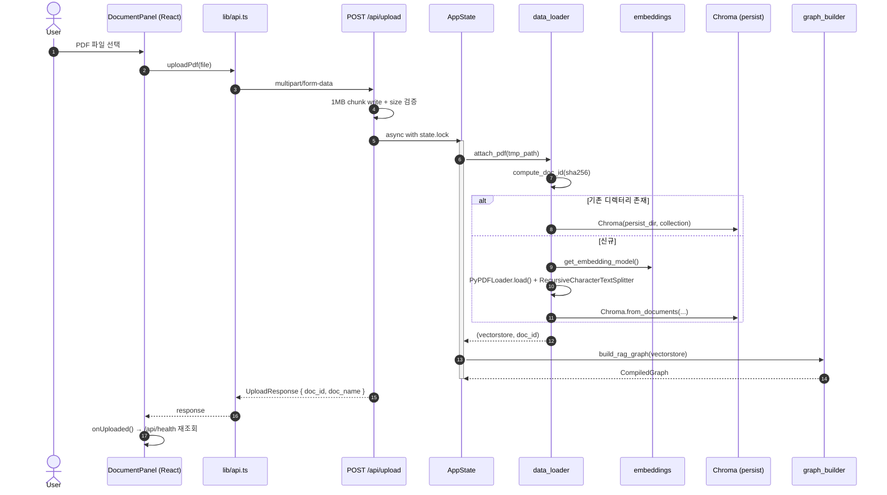

### 4.2 비스트리밍 쿼리 (`POST /api/query`)

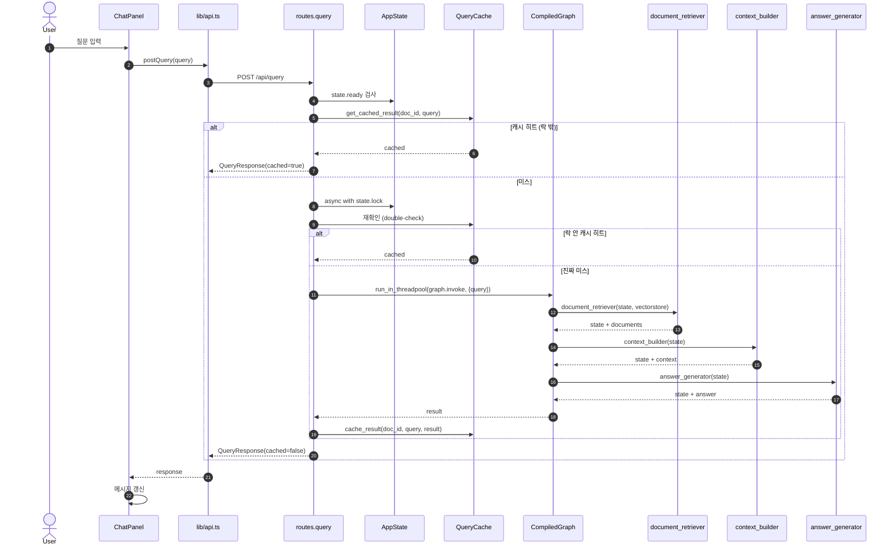

### 4.3 스트리밍 쿼리 (`POST /api/query/stream`, SSE)

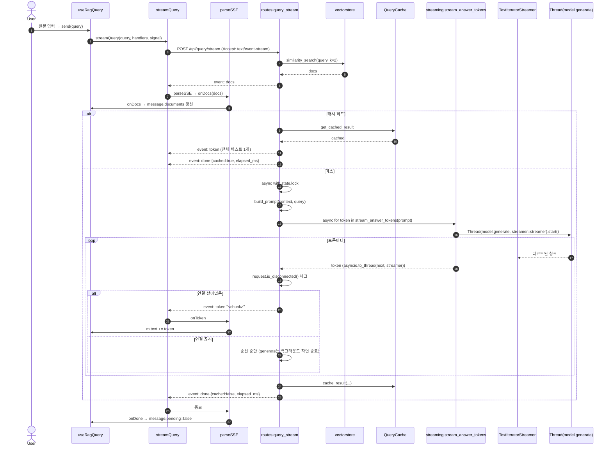

### 4.4 취소 (AbortController)

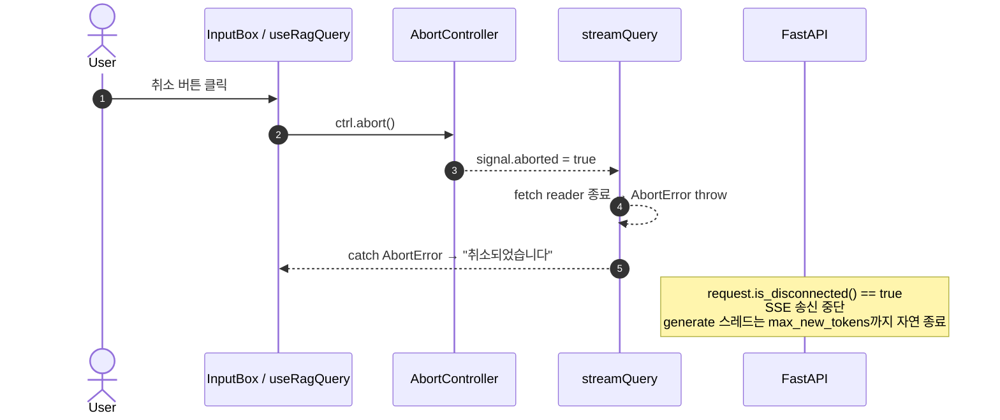

---

## 5. 상태 다이어그램 — RAG 워크플로우 (LangGraph)

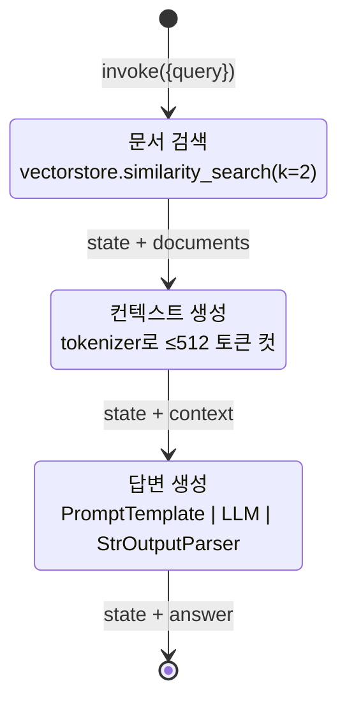

---

## 6. 활동 다이어그램 — `/api/query` 핸들러 결정 흐름

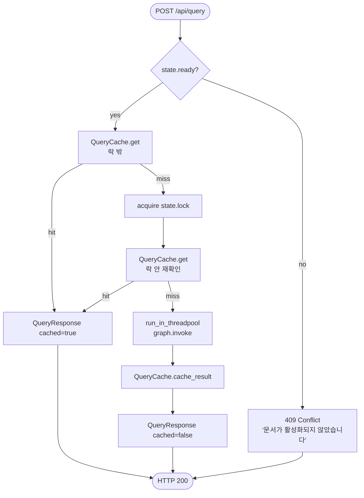

---

## 7. 배포 다이어그램 (dev)

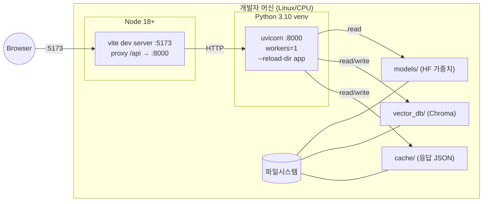
